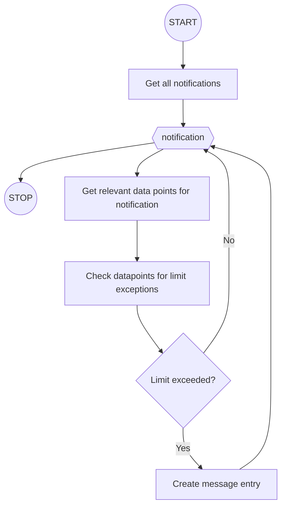
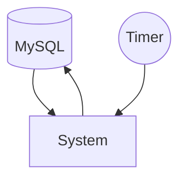

## Description
This service functions as a notification system that checks data against set limits and sends out notifications if the limits are exceeded

## System information

Prerequisites:
 - .NET knowledge

### System flow

### System architecture

### Assignment
Conduct a code review on the application to improve the quality of the code, improve efficiency and ensure correctness as described in the scope.

The candidate is not expected to spend longer than 30 minutes on this question, however, the canidate is allowed to spend more time.