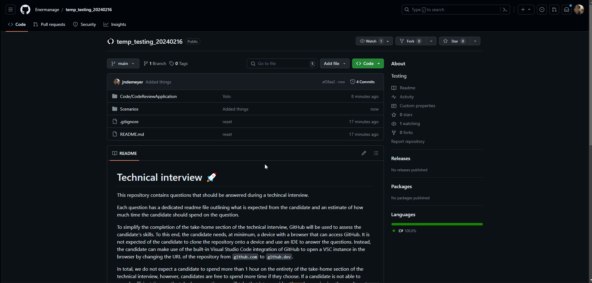
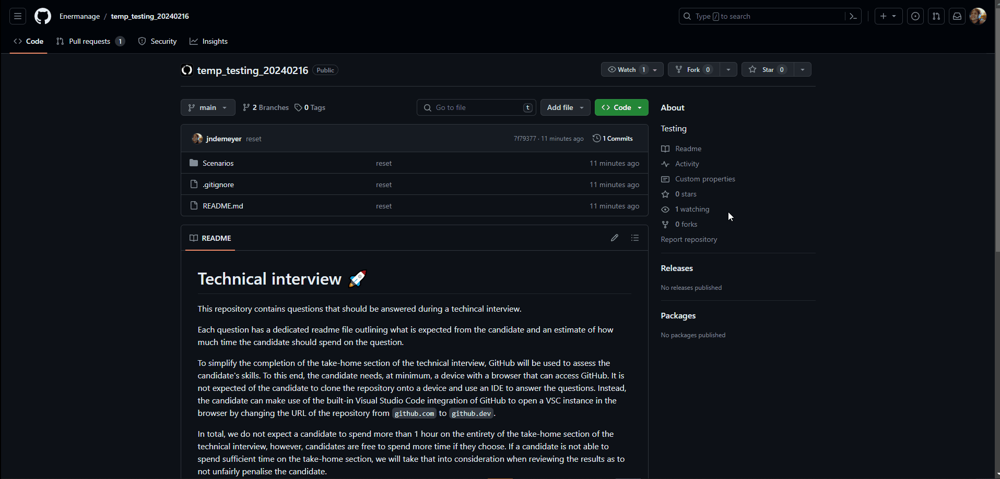

# Technical interview 🚀

This repository contains questions that should be answered during a techincal interview.

Each question has a dedicated readme file outlining what is expected from the candidate and an estimate of how much time the candidate should spend on the question.

To simplify the completion of the take-home section of the technical interview, GitHub will be used to assess the candidate's skills. To this end, the candidate needs, at minimum,
a device with a browser that can access GitHub. It is not expected of the candidate to clone the repository onto a device and use an IDE to answer the questions. Instead,
the candidate can make use of the built-in Visual Studio Code integration of GitHub to open a VSC instance in the browser by changing the URL of the repository from
`github.com` to `github.dev`.

The candidate can answer questions directly on GitHub by creating a fork of the repository and editing the files directly in a new branch created in the browser. See the
below gif for an example of how this would work.

In total, we do not expect a candidate to spend more than 1 hour on the entirety of the take-home section of the technical interview, however, candidates are free to spend
more time if they choose. If a candidate is not able to spend sufficient time on the take-home section, we will take that into consideration when reviewing the results as to not
unfairly penalise the candidate.

## [1. Scenarios](Scenarios)
This section contains scenario questions to ask potential candidates to observe their problem solving skills and way of thinking. 
Each scenario consists of detailed background information and poses the candidate a question that they should answer. 
The candidate should create a new branch from the main branch and answer the question on the branch by including text files with the answer, diagrams, voice notes, videos,
or anything to help convey how the candidate would approach the specific scenario.

### [System](Scenarios/System)
System scenarios pose questions about general system interactions, etc. and does not focus on technical expertise. 
These scenarios are designed to test how the candidate looks at the bigger picture, how they draw conclusions from information and how they approach problems.

### [.NET](Scenarios/.NET)
.NET scenarios pose questions about .NET knowledge to test the experience of the candidate and how they would approach .NET specific problems without diving into code.

## [2. Code questions](Code)
Code questions are designed to dive into the more technical knowledge of a candidate to test them for specific skills. 
Each code question consists of detailed background information and poses the candidate a question that they should answer. 
The candidate should either conduct a code review to answer the question or create a new branch from the main branch and answer the question on the branch by 
including text files with the answer, diagrams, voice notes, videos,
or anything to help convey how the candidate would approach the specific scenario.

If a code review is required, the candidate can perform a code review for the specific question despite not being assigned to it. See the gif below on how this would work:

