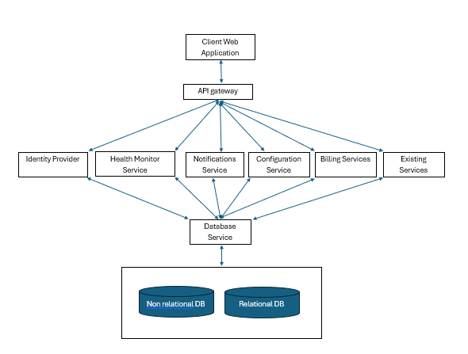

I always consider Simon Sineks Goldern circle when embarking on delivering solutions to problems. Although the context in which he discusses the principles is in business strategy I believe that it is applicable and important in solution desing as well. Here is a short video of him explaining https://youtu.be/Jeg3lIK8lro.

 The goldern circle - Simon Sinek

The 'WHY' is defined in the scenario - to monitor the health of large machinery at clients fascilities.

The 'WHAT' is also partially explained in the scenario - "Management wants you to create a web application service". However, the underlying solution (the web application) is yet to be discovered. Hence my approach would be to firstly focus on the essence of what this web application is intended to solving.

The 'HOW' will be uncovered by the majority of this document - How would you go about designing and implementing the system?

=========================================================================================================================

The choice of the approach is motivated by the nature of the requirement. The requirement is quite general and the ideal solution needs to be uncovered in a series of iterations for the solution to derive value in a timely and cost effective manner. The design and implementation approach of such an application would include gathering requirements, planning, analysis, designing, Implementing, testing, deployment and evaluating phases.

#  Planning and requirements

Initially, determing the stakeholders' and/or clients' needs, and systems requirements is important to establish by engaging with the potential stakeholders to better understand their requirements for machinery monitoring in the web application. This is expected to cover information regarding the types of machines, data that needs to be tracked, the frequency at which data needs to be updated, any specific details in the form of notifications or reporting, and so on. 

Once the requirements have been gathered, a scope of the system needs to be drawn in order for the project timelines to be established and avoid building features that are out of scope. The scope will be broken down into manageable iterations and planned according to the project timeline using an iterative project management method. 

In addition to uncovering what needs to be done, the service model needs to be defined, including the price per license. Determining the definition for a "license" in the context of the service to be provided is crucial (for example, is the application licensed per volume of data handled, per machine registered etc.).

After the above has been discovered, an analysis and design of the requirements needs to be done where the 'HOW' is modeled then after, the focus would shift to implementing the solution. 

The requirements and plan should be documented and centralized for reference.

Below is an outline of the approach.

# Analysis & Design

The system design is justified in terms of the expected behavior of the final product.
It has a special focus on integration with existing services, scalability, security, and customer satisfaction.  

## Architecture
To support the growth of the system and at the same time flexibility, I would adopt a microservice-architecture considering that the application would integrate with existing and future services. A mircoservices architecture will allow independent development, deployment, and scalable services for the application. The modularity of the architecture enables each service to be responsible for a specific aspect of the application based on business functionalities. Below is a high level depiction of the architecture to be adopted.

Machine monitor Microservice architecture

## Database Design 
The databases required for the machine monitoring application will be informed by the requirements gathered. The purpose of designing the database is to manage complexity, communicate the requirements, make informed decisions and identify gaps within the database before it is implemented.

### Relational Database
 Entity Relationship will be modeled from the secified requirements -  a simple notation to reason about the data and the database. 

The process of designing the ER includes:
- Identifying entity sets
- Describing the  entity sets with attributes
- Specifying the relationships between the entities involved
- Choosing keys for the entities
- Checking for weak entity sets
- Identifying constraints
- Checking for multivalues, optional an derived attributes

The ER schema that will be formed from the requirements will then be reduced to database tables.

### Non-Relational Database 
Non-relational databases also need to be designed. The data types and the volumes of the data need to be identified. The design also will define the data access patterns. This helps in deciding on the right database  whether document stores, graph databases, key-value stores need to be adopted for this purpose.

To improve scalability considerations to partition the data into clusters need to be made.

The scenario has already outlined the databses that are being used. For large data volumes, a non-relational database like Mongodb will be applicable to scalability and flexibility as suggested. On the other hand, for masterdata and service configuration data, a relational database like MySQL will be considered. The schema of the databases should ensure efficient data storage and querying. 

## Prototyping
Once the requirements have been gathered and analysed, it is essential to create prototypes to refine the requirements.
This helps visualise and get feedback from the potential client. These prototypes are to be done in the early iterations of design so that resources are used sparingly.

## API Gateway
Design RESTful APIs that connect with existing services through an API gateway, allowing retrieval of monitoring data; ensuring that these APIs are secure, scalable, and well documented. 
Security of the application should be ensured by adequate authentication and authorization mechanisms like OAuth2 and JWT, data encryption for sensitive data and periodic security audits.

By centralising requests through an API Gateway, the client is relieved of the burden of engaging with several, potentially different microservices. 

The analysis and design should be documented including its artifects and centralized for reference.

# Implementation
This phase is focused on turning the design of the system into a working software solution. 

## Method
The method used to implement the solution will be an agile iterative process where the goal is reached in a series of ever improving delivery cycles as depicted in the image below. The implementation is a series of short mini projects. Each iteration gives a tested, integrated and executable system, ensuring sustainable feedback and adaptation to changing needs.

 
Iterative process

This method is suitable for this kind of task where the risk of the project failing is greatly reduced by taking one shot at the project and steering the way to success using information instead of launching blindly to the unknown. High priority features aree developed first and user feedback is gathered and the cycle repeats until the requirements are met.
 
## Backend
 
Implement the earlier designed Restful APIs such that they expose functionality of the system securely. Moreover, ensure that the system is well integrated with the services required in place by the use of APIs in data exchange and extending functionality. Further implement the services required each with its own business logic and domail model.

## Frontend
Develop user interfaces that the user interacts with to configure service, view machine health metrics and get notifications adapted from the prototypes in the design phase. To achieve this, I would adopt the use of morden, responsive, and interactive UIs using either front-end development frameworks such as Angular, Vuejs or React for modularity and scalability, depending on the expertise available to the company. Integrate with the backend APIs for maachine monitoring data to be accessible to the client from the front-end.

## Database
Setup the databases schema according to the design defining the tables, relationships and optimized queries.

## Vernsion control
Setup a version control system for the application.

## Testing
For each iteration unit tests, end to end testing and integration tests should be done for the executable system to be reliable and performant. A quality assurance stage should also be setup to test the system before it is deployed to production.

## Continuous integration and deployment
Since a microservice achitecture will be adopted, a poly-repository approach would be considered where each services code base is completely seperate. 

 The application should be deployed to a dependable hosting service and configured for monitoring an logging considering containerization of the services.CI/CD pipelines should be configured for each repository to a QA stage an a production stage to ensure continuos integration an deployment. 

The Implementation should be documented and centralized for reference.

