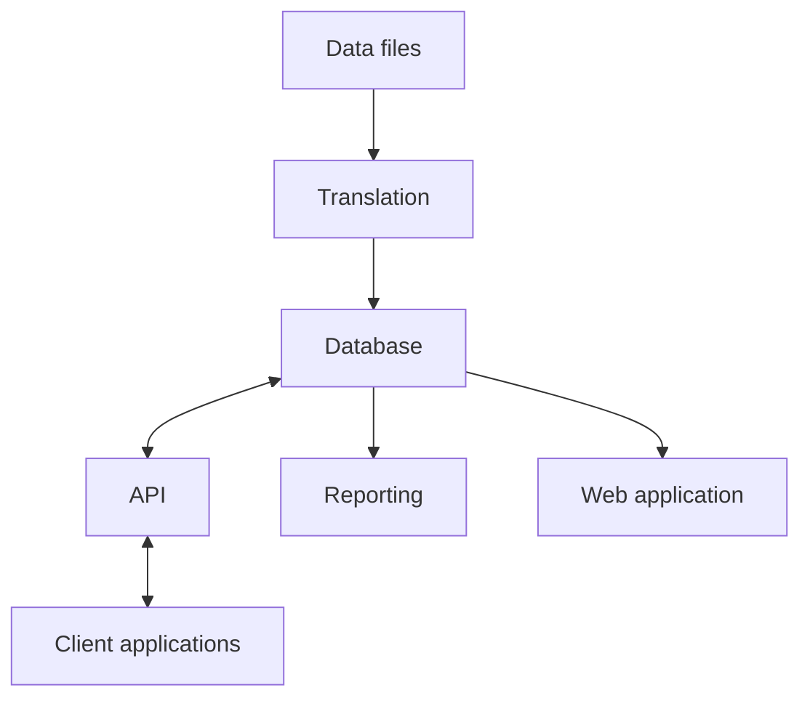

# Description
You work on an integrated system and the performance of the systems start degrading and you have to investigate why.

## Scenario
Your company offers various services to clients. The entire systems consists of the following:

 - A database that stores the data used by all of the services .
 - A translation services that transforms data files into a more usable format and saves it to the database
 - An API service that is accessible to the clients for so they can create their own services to access data
 - An automated reporting service that generates and sends reports to clients
 - A web application accessible to clients that monitors and displays the trends in the data

The whole system suddenly becomes very slow. How do you figure out what is causing this?

### Additional information
 - N/A
 
 ### Assignment
 Answer the question presented in the Scenario section by means of a branch based on main. 
 Make use of text, voice notes, videos, diagrams, or anything else that will help you answer the question
 and get your point across.

The candidate is not expected to spend longer than 10 minutes on this question, however, the canidate is allowed to spend more time.